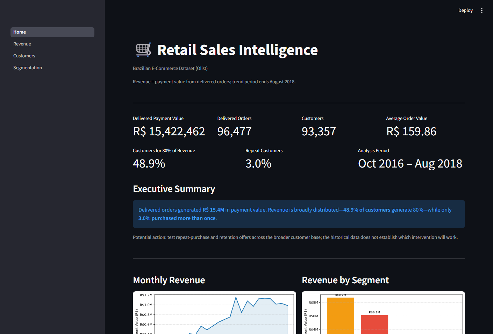
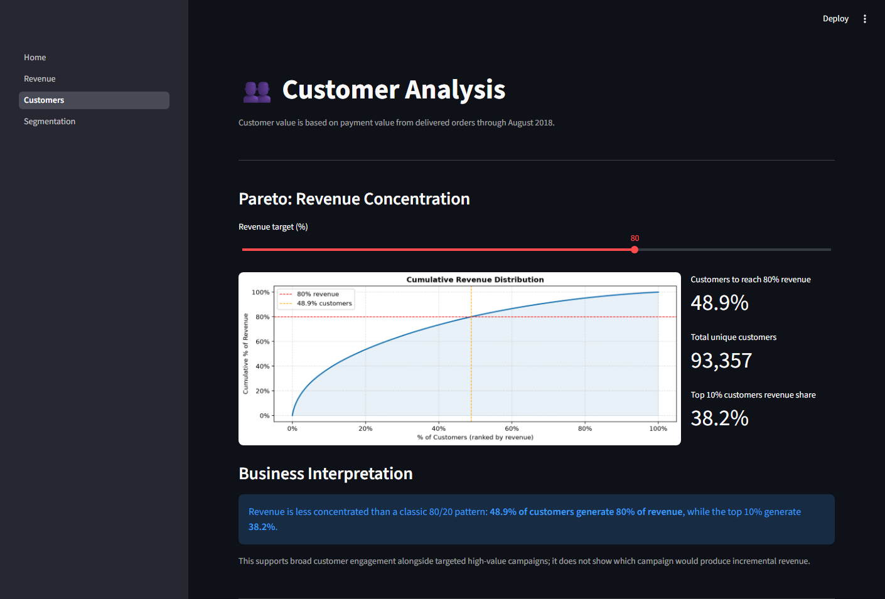

# Retail Sales Intelligence

An interactive analytics project that turns Olist marketplace transactions into clear revenue, customer-value, basket-size, and RFM insights.

**[Open the live Streamlit dashboard →](https://retail-sales-intelligence-ejphgxkasfkeauxrpdcrmd.streamlit.app/)**



## Key Findings

| R$15.42M delivered payment value | 48.9% of customers generate 80% of revenue |
|---|---|
| **90.0%** of orders contain one item | Only **3.0%** of customers purchased more than once |

**Stack:** Python · SQL · Pandas · Matplotlib · Streamlit

## What This Project Answers

- How did delivered-order payment value change over time?
- How concentrated is revenue across the customer base?
- What does the typical order basket look like?
- Which customers are recent, repeat, high-value, or candidates for re-engagement?

The result is a four-page Streamlit dashboard supported by reusable Python transformations, recruiter-visible SQL analysis, and focused tests for the critical business calculations.

## Dashboard

- **Executive Overview** - Payment value, orders, customers, average order value, revenue concentration, repeat purchasing, and segment performance.
- **Revenue** - Monthly trend, year filtering, peak month, and a detailed monthly table.
- **Customers** - Pareto revenue concentration and items-per-order behavior.
- **Segmentation** - Behavior-based RFM segments, segment value, recency-versus-monetary patterns, and customer drill-down.



## Analytical Definitions

The analysis uses the [Brazilian E-Commerce Public Dataset by Olist](https://www.kaggle.com/datasets/olistbr/brazilian-ecommerce).

Revenue is defined as payment value from **delivered orders purchased before September 1, 2018**. Sparse September and October 2018 records are excluded so incomplete periods do not distort trends or averages. This population is used consistently for KPIs, customer revenue, Pareto analysis, basket metrics, and RFM segmentation.

Customer segments use transparent business rules:

- **VIP** - Repeat buyers in the top two recency and monetary bands.
- **Loyal** - Other repeat buyers in the top three recency bands.
- **At Risk** - Customers in the bottom two recency bands.
- **Regular** - All remaining customers, including one-time buyers.

`At Risk` describes low recency within this historical dataset; it does not prove customer churn.

## SQL Analysis

[View the business analysis queries](sql/business_analysis.sql). They demonstrate:

- CTEs that establish a consistent delivered-order population
- Joins across orders, payments, and customers
- Aggregations for monthly and customer-level metrics
- `COUNT(DISTINCT order_id)` for purchase frequency
- Window functions for cumulative revenue concentration

PostgreSQL syntax is used for the standalone analysis, but PostgreSQL is **not required** to run the dashboard.

## Project Structure

```text
app/          Streamlit entry point and dashboard pages
src/          Data loading, transformations, and RFM logic
sql/          Recruiter-visible business analysis queries
tests/        Focused tests for critical analytical calculations
notebooks/    Exploratory analysis and development history
data/raw/     Four Olist CSV files used by the dashboard
docs/images/  Dashboard screenshots used in this README
```

The notebook records exploratory development; the primary application architecture is the modular `app/` and `src/` code.

## Run the Dashboard

Python 3.11 or newer is supported. The project was verified with Python 3.14.5.

From the repository root in Windows PowerShell:

```powershell
py -m venv .venv
.\.venv\Scripts\Activate.ps1
python -m pip install -r requirements.txt
streamlit run app/Home.py
```

Open `http://localhost:8501`, then run the focused tests with:

```powershell
python -m unittest discover -s tests -v
```

### Optional Notebook and PostgreSQL Workflow

The Streamlit dashboard reads the included CSV files directly. To run the notebook and its optional PostgreSQL cells:

```powershell
python -m pip install jupyter sqlalchemy psycopg2-binary
jupyter notebook notebooks/01_data_loading.ipynb
```

The PostgreSQL cells additionally require a `DATABASE_URL` environment variable. This workflow is optional and is not part of the dashboard startup path.

## Scope and Limitations

- Payment value is analyzed as a revenue proxy; the dataset does not provide profit or margin.
- Suggested actions such as bundles or re-engagement campaigns are hypotheses to test, not measured causal outcomes.
- Results describe a historical marketplace period ending in August 2018.

## Author

FrancoFM93

