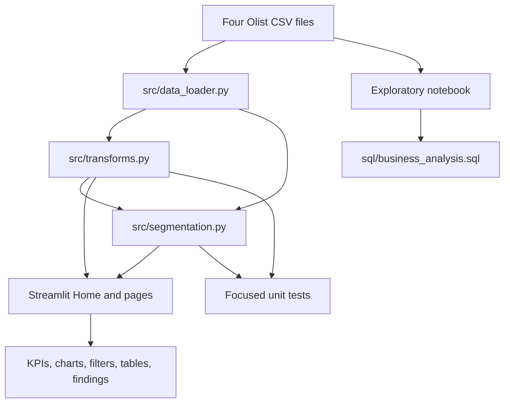

# Retail Sales Intelligence: Technical Walkthrough

This document is a study guide for the project author. It explains what the code does technically, why the project makes each important decision, and how to describe those decisions honestly in an interview.

## 1. Project overview

Retail Sales Intelligence analyzes transactions from the Brazilian E-Commerce Public Dataset by Olist. Its main output is a four-page Streamlit application covering:

- delivered-order payment value over time;
- revenue concentration across customers;
- items per order;
- customer recency, frequency, monetary value, and segments.

The application receives four CSV files as input:

1. customers;
2. orders;
3. order items;
4. payments.

It produces Pandas DataFrames, KPI values, Matplotlib charts, interactive filters, tables, and written business interpretations. The standalone SQL file calculates equivalent business outputs in PostgreSQL syntax. The notebook records exploration and development history. The tests protect a few calculations whose failure would make the analysis misleading.



The project demonstrates practical Python, Pandas transformations, SQL, analytical definitions, business interpretation, visualization, Streamlit, and a small amount of testing. It deliberately does not demonstrate orchestration, a warehouse, cloud infrastructure, machine learning, or a production data platform. Those are outside the role of this visual analytics project.

## 2. Repository structure

| Path | Responsibility | Depends on | Called or used by | Input and output |
|---|---|---|---|---|
| `app/Home.py` | Executive overview | Streamlit, Matplotlib, `src` modules | Streamlit entry point | Loads all four CSVs; outputs KPIs, summary text, and two charts |
| `app/pages/1_Revenue.py` | Monthly revenue analysis | Streamlit, Matplotlib, loader and transforms | Streamlit multipage navigation | Receives filtered joined data; outputs trend, KPIs, interpretation, and table |
| `app/pages/2_Customers.py` | Pareto and basket analysis | Streamlit, Matplotlib, loader and transforms | Streamlit multipage navigation | Receives customer revenue and order items; outputs concentration and basket views |
| `app/pages/3_Segmentation.py` | RFM analysis | Streamlit, Matplotlib, loader and segmentation | Streamlit multipage navigation | Receives customer-level RFM data; outputs segment metrics, charts, and table |
| `src/__init__.py` | Marks `src` as a Python package | Python import system | Imports beginning with `src.` | No data |
| `src/data_loader.py` | Reads CSV files and parses the purchase timestamp | Pandas, `pathlib` | All Streamlit pages; notebook uses similar direct reads | CSV files in, four DataFrames out |
| `src/transforms.py` | Shared order filtering, joins, monthly/customer/Pareto/basket calculations | Pandas | Home, Revenue, Customers, segmentation, tests | DataFrames in, filtered or aggregated DataFrames out |
| `src/segmentation.py` | RFM metrics, scores, and segment rules | Pandas, shared order filter | Home, Segmentation page, tests | Orders/payments/customers in, one row per unique customer out |
| `sql/business_analysis.sql` | Recruiter-visible SQL versions of core analyses | PostgreSQL tables | Run manually in PostgreSQL | Relational tables in, four analytical result sets out |
| `notebooks/01_data_loading.ipynb` | Exploration, early analysis, optional PostgreSQL loading | Pandas, Matplotlib, NumPy, optional SQLAlchemy | Run interactively, not imported by the app | CSVs and optional database in, displayed exploration out |
| `tests/test_transforms.py` | Protects revenue scope, monthly aggregation, and Pareto arithmetic | `unittest`, Pandas, transforms | `unittest` discovery | Synthetic frames in, assertions out |
| `tests/test_segmentation.py` | Protects segment eligibility and precedence | `unittest`, Pandas, segmentation rule | `unittest` discovery | Synthetic Series in, expected segment names out |
| `requirements.txt` | Pins dashboard dependencies | pip | Environment installation | Package names and versions |
| `docs/images/` | Stores README screenshots | Rendered Streamlit app | README | PNG assets |
| `docs/technical-walkthrough.md` | Internal study documentation | Actual repository code | Project author | This document |

The application code lives in `app/` and `src/`. The notebook is useful evidence of exploration, but it is not the runtime architecture.

## 3. Python execution and import system

Every page begins with a form of:

```python
import sys
from pathlib import Path

sys.path.insert(0, str(Path(__file__).parent.parent.parent))
```

`Home.py` uses two `.parent` operations because it is one directory shallower:

```python
sys.path.insert(0, str(Path(__file__).parent.parent))
```

### `import sys`

`sys` is part of Python's standard library. It exposes information about the running interpreter. `sys.path` is the ordered list of locations Python searches when resolving imports.

For:

```python
from src.data_loader import load_all
```

Python searches each `sys.path` entry in order for an importable package named `src`. Inserting the repository root changes where Python looks. Index `0` means "put this location first," before installed packages and most other search locations.

This has a risk: if another package is also named `src`, the repository's local `src` wins. Manual path changes can also hide packaging mistakes. A larger production project would normally define an installable package with `pyproject.toml`, then install it in editable mode with `python -m pip install -e .`.

For a small Streamlit portfolio project, the current approach is understandable and keeps startup simple. An honest interview explanation is: "I used a direct path adjustment so each Streamlit page can import the shared `src` package regardless of how Streamlit sets the script path. I know packaging the project would be cleaner at larger scale."

### `from pathlib import Path`

`pathlib` is also in the standard library. A `Path` represents a filesystem path as an object. The `/` operator joins path components:

```python
Path(__file__).parent.parent / "data" / "raw"
```

This is clearer and more portable than manually building strings such as `"../data/raw"` or using Windows-only backslashes. `Path` chooses the correct path conventions on Windows, Linux, and macOS.

### `__file__`

`__file__` contains the path of the Python file currently being executed or imported. It is not the current working directory.

That difference matters:

- current file: `D:\Dev\retail-sales-intelligence\app\pages\1_Revenue.py`;
- possible working directory: `D:\Dev\retail-sales-intelligence`;
- another launch could use a different working directory.

Code based only on `Path.cwd()` or `"data/raw/file.csv"` can break when the launch directory changes. Code based on `__file__` starts from a stable file location.

### `.parent.parent.parent`

For `app/pages/1_Revenue.py`:

```text
1_Revenue.py
→ parent: pages/
→ parent: app/
→ parent: retail-sales-intelligence/
```

The expression starts with the file path, so three `.parent` attributes reach the repository root. `Home.py` is at `app/Home.py`, so two parents reach the same root.

### `str(...)`

`Path(...)` creates a `Path` object. Many modern Python APIs accept `Path` directly, including `pandas.read_csv`. `sys.path`, however, has traditionally stored path strings. Converting with `str(...)` makes the inserted entry match that expectation.

### `sys.path.insert(0, ...)`

Placing the repository root first makes the root's `src/` directory discoverable. Without it, a page executed in `app/pages/` may fail with:

```text
ModuleNotFoundError: No module named 'src'
```

The mechanism is practical here, but it is not the only or most formal solution.

## 4. Imports used in the application

### Standard-library imports

| Import | Use here |
|---|---|
| `sys` | Changes the module search path for local imports |
| `pathlib.Path` | Builds repository-relative, cross-platform paths |
| `unittest` | Defines and discovers focused unit tests |

`unittest` is included with Python, so the project does not need a test dependency. `unittest.TestCase` supplies assertion methods such as `assertEqual` and `assertAlmostEqual`.

### Third-party imports

**`pandas as pd`** provides the DataFrame and Series structures and most analytical operations: `read_csv`, `to_datetime`, `merge`, `groupby`, `agg`, `sum`, `nunique`, `qcut`, `clip`, `cumsum`, masks, and formatting accessors. SQL or Polars could perform similar transformations, but Pandas fits an in-memory dataset and integrates directly with Streamlit and Matplotlib.

**`streamlit as st`** turns normal Python scripts into interactive web pages. The project uses page configuration, caching, widgets, columns, metrics, messages, expanders, tables, and chart rendering. It was selected because the goal is an interactive analytics portfolio, not a custom frontend.

**`matplotlib.pyplot as plt`** provides figure creation through `plt.subplots()`. The page then draws on explicit `Axes` objects. Alternatives include Plotly, Altair, or Streamlit's native charts. Matplotlib is appropriate because it gives precise axis formatting without adding another dependency.

**`matplotlib.dates as mdates`** appears on the Revenue page. `MonthLocator` controls which month ticks appear. `DateFormatter` controls labels such as abbreviated month and year.

**`matplotlib.ticker as mticker`** controls numeric display without changing the underlying numbers. The project uses:

- `FuncFormatter` for Brazilian real values;
- `PercentFormatter` for 0–100 percentage axes;
- `StrMethodFormatter` for comma-separated customer counts.

In an interview, distinguish calculation from presentation: Pandas calculates the values, while Matplotlib formatters decide how axis ticks look.

## 5. Streamlit execution model

Streamlit executes a page script from top to bottom. Functions, DataFrames, charts, and UI calls are evaluated in Python order. Calls such as `st.metric()` do not return HTML for you to manage; Streamlit records an element and sends it to the browser.

When a user changes a widget, Streamlit reruns that page script. For example:

```python
selected_years = st.multiselect("Filter by year", years, default=years)
```

The first run returns the default list. After the user changes the selection, the script reruns and `selected_years` contains the new list. The mask and chart are rebuilt from that new value.

### Multipage behavior

`app/Home.py` is the entry point. Streamlit discovers files under `app/pages/` and creates sidebar navigation in filename order:

1. Revenue;
2. Customers;
3. Segmentation.

Each page is a separate script. It imports shared functions rather than importing `Home.py`.

### `st.set_page_config`

This configures the browser title, icon, and layout. It should appear before normal page output. `layout="wide"` gives charts and KPI columns more horizontal room, which is useful for dashboards.

### `@st.cache_data`

This syntax applies a Python decorator:

```python
@st.cache_data
def load():
    ...
```

A decorator receives a function and returns wrapped behavior. Streamlit's wrapper checks whether it already has a cached result for the function code and argument values. The page's `load()` functions take no arguments, so each normally has one cached result.

Streamlit serializes cached data and returns cached values on later reruns. DataFrames are suitable cache values because they can be serialized. The cache is invalidated when relevant function code changes, inputs change, it is cleared manually, or Streamlit decides the cached definition no longer matches. No time-to-live is set here, so results do not expire on a timer.

Without caching, each widget interaction would reread CSV files and repeat joins and RFM calculations. The page would feel slow.

`st.cache_data` is for data results that can be copied/serialized. `st.cache_resource` is for shared resource objects such as a database connection, model instance, or client that should not be copied. This project caches DataFrames, so `st.cache_data` is the correct choice.

One nuance: each page defines its own cached `load()` function. Caches make reruns of that page faster, but the app is not defining one shared cross-page data service. That is acceptable at this scale.

### Rendering

- `st.columns()` creates layout containers.
- `st.metric()` displays a label, value, and optional delta.
- `st.pyplot(fig)` serializes a Matplotlib figure into the page.
- `st.dataframe()` displays an interactive table.
- `st.info()` and `st.caption()` present findings and limitations.
- `st.stop()` ends the current run cleanly, used when no Revenue years are selected.

## 6. Function calls and tuple unpacking

`load_all()` returns:

```python
return load_customers(), load_orders(), load_order_items(), load_payments()
```

The commas create a tuple: an ordered, fixed collection of four DataFrames.

This line unpacks by position:

```python
customers, orders, order_items, payments = load_all()
```

Position 1 goes to `customers`, position 2 to `orders`, and so on. The order is part of the function contract. If four values were returned but only three variables were supplied, Python would raise:

```text
ValueError: too many values to unpack
```

The Revenue page has another layer:

```python
df_full, monthly_revenue = load()
```

Its cached `load()` first unpacks four raw DataFrames, transforms them, then returns two prepared DataFrames. The outer line unpacks those two.

A dictionary or dataclass could name the outputs and make ordering less fragile. Tuple unpacking is still acceptable because there are only four stable inputs and the function is small.

## 7. Data-loading layer

`src/data_loader.py` defines:

```python
DATA_DIR = Path(__file__).parent.parent / "data" / "raw"
```

Starting at `src/data_loader.py`, the first parent is `src/`, the second is the repository root, then `/ "data" / "raw"` appends the dataset folder.

`pd.read_csv(path)` reads delimited text, uses the header row as column names, infers data types from values, and constructs a DataFrame. A DataFrame is a two-dimensional labeled table: rows, named columns, and an index.

Type inference is convenient but not perfect. ZIP-code prefixes can look numeric even though they are identifiers. Missing values can cause numeric columns to become floating point. Very large CSVs can use significant memory because Pandas loads them into RAM.

The orders loader performs an explicit conversion:

```python
df["order_purchase_timestamp"] = pd.to_datetime(
    df["order_purchase_timestamp"]
)
```

This changes strings into Pandas datetime values and enables `.dt.year`, `.dt.to_period("M")`, timestamp subtraction, min/max dates, and Matplotlib date handling. Malformed timestamps could raise an error because `errors="coerce"` is not used.

### Input dataset grains and keys

| Dataset | Grain | Main identifiers | Project use |
|---|---|---|---|
| `olist_customers_dataset.csv` | One customer record associated with an order | `customer_id`; `customer_unique_id` connects repeat purchases | Customer identity and revenue/RFM aggregation |
| `olist_orders_dataset.csv` | One row per order | `order_id`; foreign key `customer_id` | Status, purchase time, delivered-order population |
| `olist_order_items_dataset.csv` | One row per item position in an order | Composite meaning: `order_id` + `order_item_id` | Items per order |
| `olist_order_payments_dataset.csv` | One row per payment record for an order | `order_id` + `payment_sequential` | Payment value and revenue proxy |

An order may have multiple item rows and multiple payment rows. That fact is central to avoiding double-counting.

Missing files raise `FileNotFoundError`. A malformed CSV can raise a Pandas parser error. The application intentionally does not hide these errors because the repository includes the expected files.

## 8. Transformation pipeline

**Grain** means what one row represents. Always identify grain before joining or aggregating.

### `get_analysis_orders`

```python
def get_analysis_orders(orders: pd.DataFrame) -> pd.DataFrame:
```

- Input grain: one row per order.
- Required columns: `order_status`, `order_purchase_timestamp`.
- Filter: status equals `"delivered"` and purchase timestamp is before `2018-09-01`.
- Output grain: still one row per order, but only eligible orders.

Both mask conditions must be true because `&` combines element-wise Boolean Series. `.copy()` produces an independent DataFrame rather than a possibly ambiguous view.

### `build_orders_payments`

```python
def build_orders_payments(
    orders: pd.DataFrame, payments: pd.DataFrame
) -> pd.DataFrame:
```

First it filters orders. Then:

```python
eligible_orders.merge(payments, on="order_id")
```

Pandas uses an inner join by default. Only matching order IDs remain. The input grains are one row per order and one row per payment record. If one order has three payment records, the order columns appear three times.

Example:

```text
orders                              payments
order_id  status                    order_id  payment_value
A         delivered                A         60
                                    A         40

joined output
order_id  status      payment_value
A         delivered   60
A         delivered   40
```

Summing `payment_value` correctly gives 100. Counting joined rows would incorrectly say there were two orders. That is why order KPIs use `nunique()` and SQL frequency uses `COUNT(DISTINCT order_id)`.

Output grain: one row per payment record attached to an eligible order.

### `build_full_df`

This adds customer columns:

```python
orders_payments.merge(customers, on="customer_id")
```

The join is another inner join. `customer_id` links the order to its Olist customer record. Output grain remains payment record. The important addition is `customer_unique_id`, which identifies the same person across separate order-specific customer records.

### `get_monthly_revenue`

Signature:

```python
def get_monthly_revenue(df: pd.DataFrame) -> pd.DataFrame:
```

Input grain is payment record. Required columns are `order_purchase_timestamp` and `payment_value`.

Steps:

1. copy the input;
2. use `.assign()` to add a `month` Period column;
3. group by month;
4. sum payment values;
5. use `.reset_index()` to make month a normal column;
6. convert Period back to Timestamp for charting.

Output grain: one row per calendar month.

### Average order value

Average order value is calculated in `Home.py`:

```python
total_revenue = df_full["payment_value"].sum()
total_orders = df_full["order_id"].nunique()
avg_order_value = total_revenue / total_orders
```

The numerator uses every payment row. The denominator uses distinct order IDs. This handles split payments correctly.

### `get_customer_revenue`

Input grain is payment record. Grouping on `customer_unique_id` and summing `payment_value` changes grain to one row per real customer. Results are sorted descending because Pareto analysis must begin with the highest-value customers.

### `get_pareto`

Input grain is one row per customer, sorted by payment value descending. Output grain remains one row per customer, with:

- `cumulative_pct`: running payment value divided by all payment value;
- `customer_pct`: running row count divided by all customers.

The function assumes a nonempty input with positive total payment value. It does not explicitly handle an empty DataFrame or zero total. The real application data satisfies these assumptions.

### `get_items_per_order`

Input grain is item row. `valid_order_ids` restricts items to orders present in the delivered, paid analysis population. `.isin()` creates a Boolean membership mask.

Then:

```python
items.groupby("order_id").size()
```

counts rows within each order. Output grain is one row per order with `item_count`.

## 9. Revenue definition

The project uses **delivered-order payment value**:

```text
sum(payment_value)
for orders where order_status = "delivered"
and order_purchase_timestamp < 2018-09-01
```

Only delivered orders are included because canceled or unavailable purchases should not be presented as completed marketplace activity. September and October 2018 contain sparse records and are excluded so partial periods do not produce a false collapse or depress averages.

Related terms are not identical:

- **Gross payment value:** all recorded payment values, possibly including statuses that did not complete.
- **Booked revenue:** an accounting/business term often recognized when an order is booked; the dataset does not define accounting treatment.
- **Delivered-order payment value:** the project's precise observable metric.
- **Realized revenue:** may imply formal revenue recognition, refunds, fees, tax, or accounting rules not available here.

The UI sometimes uses the shorter word "revenue," but the captions and README define it as delivered-order payment value. This is honest because the public dataset does not contain profit, margin, refund accounting, or Olist's formal revenue recognition policy.

Consistency comes from `get_analysis_orders()`. Both `build_full_df()` and `compute_rfm()` call it. Home, Revenue, Customers, basket metrics, and RFM therefore use the same status and cutoff.

## 10. Pareto analysis

The Pareto principle is often summarized as "80% of outcomes come from 20% of causes." It is a heuristic, not a guaranteed law.

This project asks: what percentage of customers, ordered from highest to lowest payment value, is needed to reach a chosen percentage of revenue?

For 80%:

1. `get_customer_revenue()` sums payment value by `customer_unique_id`;
2. `.sort_values(ascending=False)` ranks customers;
3. `.cumsum()` produces cumulative revenue;
4. division by total revenue converts it to cumulative percent;
5. `(index + 1) / len(cr)` produces cumulative customer percent;
6. the page selects rows where cumulative revenue is at least the slider target;
7. `.iloc[0]` chooses the first threshold crossing.

The result is approximately 48.9%, not 20%. Therefore, the supported conclusion is that revenue is more broadly distributed than a classic 80/20 pattern. It would be an overstatement to say the company depends on a tiny elite or that targeting the top group will necessarily increase revenue.

Potential edge cases:

- empty input makes `iloc[0]` fail;
- zero total creates division by zero;
- unsorted input makes the curve meaningless;
- negative values, if refunds were represented, would complicate monotonic cumulative percentages.

The current filtered dataset avoids those cases, but knowing them shows you understand the function's assumptions.

## 11. Basket analysis

An order is identified by `order_id`. One order can contain several rows in `order_items`, one for each item position. Therefore:

- item-table grain: item row;
- grouped output grain: order;
- `groupby("order_id").size()`: count of items in each order.

The single-item percentage is:

```python
items_per_order["item_count"].eq(1).mean() * 100
```

The comparison returns `True` or `False`. In a mean, Pandas treats `True` as 1 and `False` as 0, so the mean is the proportion of single-item orders.

The histogram clips values:

```python
capped = item_count.clip(upper=cap)
```

If `cap` is 10, baskets containing 10, 11, or 21 items all appear in the `10+` bin. The benefit is readability because rare large orders no longer stretch the x-axis. The cost is loss of detail in the tail. The dashboard labels the last tick with `+` to make that loss explicit.

The data can motivate experiments such as bundles or cross-selling. It does not prove those actions will work, because the analysis does not measure treatment effects, customer intent, margins, or product compatibility.

## 12. RFM and segmentation

RFM means:

- **Recency:** days since a customer's most recent purchase;
- **Frequency:** number of distinct purchases;
- **Monetary:** total delivered-order payment value.

The calculation uses `customer_unique_id`. In Olist, `customer_id` is tied to an order-specific customer record. Grouping on it would split a repeat buyer into separate "customers" and make repeat frequency nearly impossible.

### Reference date

```python
snapshot = pd.Timestamp("2018-09-01")
```

This is the first excluded date and the day after the final complete analysis month. Recency is:

```python
(snapshot - x.max()).days
```

For each customer, `x.max()` finds the latest eligible purchase timestamp.

### Frequency

```python
frequency=("order_id", "nunique")
```

`nunique` is essential because an order can have multiple payment rows. Plain row count would treat split payments as extra purchases.

### Monetary

```python
monetary=("payment_value", "sum")
```

This sums all payment records for eligible orders. Here, multiple payment rows should be added, because together they represent the order's total payment value.

### Scores

Recency and monetary use `pd.qcut`, which divides the observed distribution into approximately equal-sized quantile groups.

For recency, lower is better, so labels are reversed:

```python
labels=[5, 4, 3, 2, 1]
```

For monetary, larger is better:

```python
labels=[1, 2, 3, 4, 5]
```

`duplicates="drop"` tells Pandas to drop duplicate bin edges if tied values prevent unique boundaries. In this dataset, the calculation produces the expected five scores.

Frequency does not use quantiles:

```python
rfm["F_score"] = rfm["frequency"].clip(upper=5).astype(int)
```

It is actual order count, capped at 5. A score of 5 means five or more orders.

### Why forced frequency quintiles failed

About 97% of customers purchased only once. The earlier approach ranked tied frequency values with `rank(method="first")` and then divided those artificial ranks into quintiles. Two one-time buyers with identical behavior could receive different scores based only on row order. That allowed one-time buyers to become Loyal or VIP.

The corrected approach requires actual repeat behavior.

### Exact segment rules

Rules are evaluated in order:

1. **VIP:** `frequency >= 2`, `R_score >= 4`, and `M_score >= 4`.
2. **Loyal:** `frequency >= 2` and `R_score >= 3`, unless already VIP.
3. **At Risk:** `R_score <= 2`, unless already matched above.
4. **Regular:** everyone else, including recent one-time buyers.

Precedence matters. A repeat buyer with low recency score becomes At Risk rather than Loyal. A recent, high-value repeat buyer matches VIP before Loyal.

### Worked fictional examples

| Customer | Recency | Frequency | Monetary | R score | M score | Segment | Reason |
|---|---:|---:|---:|---:|---:|---|---|
| Ana | 15 days | 3 | R$900 | 5 | 5 | VIP | Repeat, recent, high value |
| Bruno | 120 days | 2 | R$120 | 3 | 2 | Loyal | Repeat and at least middle recency |
| Carla | 8 days | 1 | R$1,200 | 5 | 5 | Regular | One purchase cannot be VIP or Loyal |
| Diego | 400 days | 3 | R$850 | 2 | 5 | At Risk | Repeat but not recent; low R score |

`At Risk` is a heuristic label for low recency. It does not prove churn. There is no observed future period, contractual churn event, or causal model.

Alternative segmentation approaches include fixed day thresholds, domain-defined order thresholds, two-dimensional value/engagement matrices, clustering, or cohort-specific scoring. If challenged, say: "I chose explicit rules because the frequency distribution is extremely skewed. I wanted identical one-time behavior to receive identical treatment and required observed repeat purchasing for loyalty labels. The thresholds are business heuristics and should be validated against campaign outcomes in a real company."

## 13. Dashboard pages

### Home

**Question:** What is the overall scale of completed activity, how concentrated is customer value, and where is the clearest opportunity?

The cached `load_data()` calls `load_all()`, `build_full_df()`, monthly and customer transformations, and `compute_rfm()`. It returns four DataFrames.

KPIs:

- total payment value: sum of payment rows;
- delivered orders: distinct `order_id`;
- customers: distinct `customer_unique_id`;
- average order value: total divided by distinct orders;
- customer percentage for 80% revenue;
- repeat-customer percentage;
- analysis period.

The monthly chart uses a line and filled area. `FuncFormatter` displays millions of Brazilian reais without changing the values. The segment chart groups customer-level monetary values, draws bars, and labels them.

Failure cases include missing CSVs, no eligible orders, or a zero revenue total. Caching reduces rerun cost but can show old data until cleared if CSV contents change while the app stays running.

### Revenue

**Question:** How does delivered-order payment value change by month?

`load()` returns the payment-grain full DataFrame and a monthly-grain DataFrame. The multiselect returns selected years. `.isin(selected_years)` creates the row mask. An empty list triggers `st.stop()`, preventing `NaN` KPIs and empty plotting.

Matplotlib concepts:

- `fig, ax = plt.subplots()` creates a Figure container and one Axes plotting area;
- `fill_between` adds the shaded region;
- `plot` adds the line;
- `MonthLocator(interval=3)` places quarterly tick positions;
- `DateFormatter("%b\n%Y")` formats date labels;
- `FuncFormatter` formats currency ticks;
- `fig.tight_layout()` reduces label clipping;
- `st.pyplot(fig)` sends the finished figure to Streamlit.

The peak row is found with `idxmax()`. The page reports selected total and average. Its limitation is causal: transaction tables show when revenue changed, not which promotion or external event caused it.

### Customers

**Question:** How concentrated is revenue, and how many items are usually in an order?

The cached loader produces:

- one row per customer revenue;
- the same rows with Pareto columns;
- one row per eligible order with item count.

The Pareto slider reruns the page with a new target. Horizontal and vertical reference lines show the threshold. `PercentFormatter(xmax=100)` tells Matplotlib that values already range from 0 to 100.

The histogram uses a user-selected cap. Rare outliers are combined into the final `cap+` bin. Currency is not shown because the basket chart measures item counts.

Potential failures are an empty Pareto frame, an unreachable threshold, or no matching item rows.

### Segmentation

**Question:** How are customers distributed across behavior-based RFM groups?

The cached loader returns one row per unique customer. It calculates segment counts and segment monetary totals. `reindex(priority_segments, fill_value=0)` safely returns zero if an expected priority segment is absent.

Charts:

- customer counts by segment;
- payment value by segment;
- recency versus monetary scatter.

The scatter uses:

```python
ax3.set_yscale("log")
```

A logarithmic scale compresses large outliers and expands lower values. Equal vertical distances represent multiplication ratios, not equal currency differences. It requires positive monetary values.

The selectbox returns one segment. The page reruns and filters the RFM DataFrame for the drill-down table.

`At Risk` is not a churn prediction. The page says so explicitly.

### Matplotlib lifecycle

Each rerun creates new Figure objects and passes them to Streamlit. In long-running custom loops, figures should be closed with `plt.close(fig)` to prevent memory accumulation. These pages create a small fixed number per rerun, and Streamlit manages the script lifecycle, so the current approach works. Explicit closing after `st.pyplot` could be added if memory profiling showed a problem.

## 14. SQL walkthrough

`sql/business_analysis.sql` uses PostgreSQL syntax and repeats an `eligible_orders` CTE so each query can run independently.

### Useful logical execution model

```text
FROM / JOIN
→ WHERE
→ GROUP BY
→ aggregates
→ HAVING
→ window functions
→ SELECT
→ ORDER BY
→ LIMIT
```

This is a reasoning model. A database optimizer can execute physical operations differently while preserving the same result.

### Query 1: monthly revenue

**Question:** What is delivered-order payment value by month?

The CTE joins `orders` to `payments`, filters delivered orders before the cutoff, and groups payment rows by order. `SUM(p.payment_value)` makes the CTE grain one row per order.

The outer query truncates `purchased_at` to month, groups again, and sums order payment values. Final grain: one row per month.

This corresponds to `build_orders_payments()` plus `get_monthly_revenue()` in Python.

### Query 2: top customers

The CTE again produces one row per eligible order. The outer query joins customers through `customer_id`, groups by `customer_unique_id`, and sums order payment values. It sorts descending and limits the result to ten customers.

Final grain: one row per selected customer.

### Query 3: customer revenue concentration

The first CTE is one row per eligible order. `customer_revenue` changes grain to one row per unique customer.

The final query uses window functions:

```sql
ROW_NUMBER() OVER (ORDER BY revenue DESC)
COUNT(*) OVER ()
SUM(revenue) OVER (
    ORDER BY revenue DESC
    ROWS BETWEEN UNBOUNDED PRECEDING AND CURRENT ROW
)
SUM(revenue) OVER ()
```

Unlike `GROUP BY`, window functions keep each customer row while calculating values across related rows. The running `SUM` matches Pandas `cumsum()`. Final grain remains customer.

### Query 4: RFM

The CTE is one row per eligible order. The outer query joins customers and groups by `customer_unique_id`.

- recency: fixed date minus latest purchase date;
- frequency: `COUNT(DISTINCT eo.order_id)`;
- monetary: `SUM(eo.payment_value)`.

Distinct count is defensive and semantically correct. Even if the CTE is already at order grain, it states that frequency means unique orders and protects the calculation if upstream grain changes.

The SQL stops at raw RFM metrics. Python additionally calculates quantile scores and assigns segments for the live dashboard.

### Dialect differences

`DATE_TRUNC`, `::timestamp`, `DATE '2018-09-01'`, and date subtraction are PostgreSQL forms. Other databases may use `CAST`, `DATETIME`, `TIMESTAMPDIFF`, or different date functions. CTEs, joins, grouping, and window-function concepts are portable even when syntax differs.

## 15. Tests

The project uses Python's standard-library `unittest`.

Run:

```powershell
python -m unittest discover -s tests -v
```

Discovery searches the `tests` directory for files named `test*.py`, imports them, finds `unittest.TestCase` subclasses, and runs methods beginning with `test`.

### Revenue fixture and test

`RevenueTests.setUp()` creates three tiny DataFrames:

- one delivered August order;
- one canceled August order;
- one delivered order exactly on September 1;
- two payment rows for the valid order.

Arrange–Act–Assert:

1. **Arrange:** construct synthetic frames.
2. **Act:** call `build_full_df()` and `get_monthly_revenue()`.
3. **Assert:** only the delivered pre-cutoff order remains; both payments sum to 100; the monthly output is August 2018.

The test fails if status filtering, exclusive cutoff logic, split-payment summation, or monthly grouping regresses.

### Pareto test

Three customers have values 60, 30, and 10. Expected cumulative percentages are 60, 90, and 100. The second customer is two of three customers, or 66.67%.

The test protects the running sum and customer-percentage formula. It does not test sorting because the fixture is already sorted, matching the function's input contract.

### Segmentation tests

The first test gives a one-time buyer the best recency and monetary scores. The expected segment is Regular. It protects the repeat-purchase requirement.

The second test creates:

- a qualifying VIP;
- a qualifying Loyal customer;
- a repeat but low-recency At Risk customer.

It protects exact rule boundaries and precedence.

### Why small synthetic data?

Small fixtures are fast, deterministic, and make failures easy to understand. Loading all CSVs would make these unit tests slow and would mix file integration with calculation logic.

The suite intentionally does not test every chart label, Streamlit widget, CSV schema, SQL execution, or notebook cell. Streamlit page checks are integration-style verification performed separately: they execute whole page scripts and confirm no uncaught exception.

Four focused tests are reasonable because they protect the calculations most likely to damage business credibility. This is not presented as enterprise-grade coverage.

## 16. Notebook role

The notebook records the exploratory path:

- reading and inspecting source tables;
- investigating payment multiplicity;
- calculating early revenue and Pareto results;
- loading optional PostgreSQL tables;
- trying SQL queries;
- developing RFM logic and charts.

Exploratory analysis means using flexible, iterative code to understand data, test ideas, and discover problems. A notebook helps because code, output, charts, and narrative appear together.

Notebook execution has hidden state. Cells can run out of order. A variable may exist because an earlier cell ran yesterday, even if the current visible order would not create it. Stored outputs can also become stale after code changes.

Regular modules run in a defined order and are importable and testable. That is why final shared logic lives in `src/`, the dashboard in `app/`, and SQL in a standalone file.

Focus on these notebook parts:

- table grains and joins;
- multiple payments per order;
- initial monthly/customer analysis;
- why SQL uses distinct orders;
- evolution from forced frequency ranks to actual repeat-purchase rules.

PostgreSQL is optional. The dashboard does not import SQLAlchemy or require `DATABASE_URL`.

## 17. Requirements and environment

`requirements.txt` contains:

```text
matplotlib==3.11.1
pandas==3.0.5
streamlit==1.60.0
```

`pip` reads this file and installs those exact versions plus their transitive dependencies. Exact pins improve reproducibility because two people install the same direct versions. The tradeoff is that upgrades require an explicit edit. Compatible ranges such as `pandas>=3.0,<4` accept updates but can introduce behavior changes.

These pinned packages require Python 3.11 or newer. The project has been verified on Python 3.14.5.

A virtual environment is an isolated Python installation for one project. It prevents this repository's dependencies from colliding with packages used elsewhere.

Windows PowerShell:

```powershell
py -m venv .venv
.\.venv\Scripts\Activate.ps1
python -m pip install -r requirements.txt
```

`python -m pip` means: run the `pip` module with the currently selected Python interpreter. This is safer than a bare `pip` command because it reduces the chance of installing into a different Python.

Likewise:

```powershell
python -m streamlit run app/Home.py
```

ensures Streamlit is launched from the active interpreter. A bare `streamlit` command usually works after activation, but PATH misconfiguration can point to another environment.

If a dependency is missing, Python raises `ModuleNotFoundError` during import.

## 18. Running the project

### 1. Clone

```powershell
git clone https://github.com/FrancoFM93/retail-sales-intelligence.git
```

This downloads the Git repository and working files.

### 2. Enter the directory

```powershell
cd retail-sales-intelligence
```

Commands now run with the repository root as the working directory.

### 3. Create an environment

```powershell
py -m venv .venv
```

This creates an isolated interpreter under `.venv/`.

### 4. Activate it

```powershell
.\.venv\Scripts\Activate.ps1
```

PowerShell updates the current session so `python` and installed commands point to `.venv`.

### 5. Install dependencies

```powershell
python -m pip install -r requirements.txt
```

### 6. Run tests

```powershell
python -m unittest discover -s tests -v
```

### 7. Start Streamlit

```powershell
python -m streamlit run app/Home.py
```

### 8. Open the app

Visit `http://localhost:8501`. Streamlit normally opens it automatically.

### 9. Stop

Return to the terminal and press `Ctrl+C`. This sends an interrupt signal to the server process.

### Common errors

**`ModuleNotFoundError`:** activate the environment, install requirements, and run from the repository root. For `src`, also verify the page's `sys.path` logic has not been removed.

**Wrong working directory:** `requirements.txt`, tests, or the entry path may not resolve. Use `Get-Location` and `cd` to the root.

**Missing CSV:** verify the four tracked files under `data/raw/`. The loader reports `FileNotFoundError`.

**Environment not activated:** `python -c "import sys; print(sys.executable)"` should show `.venv`.

**Port in use:** run `python -m streamlit run app/Home.py --server.port 8502` or stop the other process.

**Stale cache:** use Streamlit's Clear cache option or restart the server after changing data.

**Broken relative paths:** launch the documented entry point. The loaders use `__file__`, but the notebook's direct CSV paths assume a root-based working directory.

## 19. Full data-flow walkthrough

### Metric: delivered payment value

1. `load_payments()` reads each `payment_value` from the payments CSV.
2. `load_orders()` reads order status and parses purchase timestamp.
3. `get_analysis_orders()` keeps delivered orders before September 1, 2018.
4. `build_orders_payments()` inner-joins on `order_id`.
5. Multiple payment rows remain because each contributes value.
6. `build_full_df()` adds customer identity.
7. Home's cached `load_data()` returns that frame.
8. `df_full["payment_value"].sum()` produces `15,422,461.77`.
9. `f"R$ {total_revenue:,.0f}"` formats it as `R$ 15,422,462`.
10. `st.metric()` renders the KPI.

### Chart: monthly revenue

1. The same payment-grain DataFrame enters `get_monthly_revenue()`.
2. Purchase timestamps become monthly Period values.
3. `groupby("month").sum()` changes grain to month.
4. Periods become timestamps.
5. Cached page data returns the monthly frame.
6. The Revenue widget selects years.
7. `.isin()` filters payment rows, and monthly totals are recalculated.
8. Matplotlib plots `month` against `payment_value`.
9. Date and currency formatters change labels only.
10. `st.pyplot()` displays the figure.

### Customer: route to a segment

Suppose one actual `customer_unique_id` has two eligible orders and three payment rows.

1. Orders are filtered to delivered pre-cutoff purchases.
2. Payments join and may create three rows.
3. Customers join and add the stable unique ID.
4. Grouping produces one customer row.
5. Latest purchase determines recency.
6. `nunique(order_id)` returns frequency 2, not payment-row count 3.
7. Payment rows sum to monetary value.
8. `qcut` determines R and M scores.
9. Frequency score is actual count 2.
10. If R is 4 and M is 4, `_segment_customer()` returns VIP.
11. The cached RFM frame feeds the KPI, charts, and drill-down.

## 20. Interview preparation

### Why did you use Streamlit?

"The project needed an interactive analytics presentation rather than a custom web product. Streamlit let me build filters, KPI cards, Matplotlib charts, and multipage navigation in Python. It keeps the focus on analysis. I would choose a separate API and frontend if the application needed complex client-side behavior or a larger engineering team."

### Why Pandas instead of SQL for the live dashboard?

"The dashboard deploys from four included CSV files and does not require a database. Pandas keeps that setup reproducible. I still demonstrate equivalent PostgreSQL analysis in `sql/business_analysis.sql`. In a production system with larger centralized tables, I would push more aggregation into the database."

### Where is SQL demonstrated?

"The standalone SQL file contains monthly revenue, top-customer, Pareto, and RFM queries. It uses CTEs, joins, aggregation, `COUNT(DISTINCT)`, and window functions. The notebook also records the optional PostgreSQL exploration."

### Why only delivered orders?

"I wanted the main metric to represent completed marketplace activity. Including canceled or unavailable orders would overstate completed value. I call the metric delivered-order payment value because the dataset does not provide formal accounting revenue."

### Why exclude September and October 2018?

"Those months are sparse and incomplete. Including them creates an artificial collapse and lowers monthly averages. The cutoff is centralized so every page uses the same population."

### Why `customer_unique_id`?

"Olist's `customer_id` identifies an order-specific customer record. `customer_unique_id` connects the same buyer across orders, which is necessary for repeat frequency and customer lifetime payment value."

### Why did the original quintile segmentation fail?

"Almost all customers bought once. Ranking ties by row order and then forcing quintiles assigned different frequency scores to identical one-time buyers. The corrected version uses actual distinct order count and requires at least two orders for VIP or Loyal."

### How do you prevent duplicate counting after joins?

"I identify the grain after each join. Payments can create several rows per order, so payment value is summed but order counts use `nunique()` in Pandas and `COUNT(DISTINCT order_id)` in SQL. Customer grouping uses `customer_unique_id`."

### What does `@st.cache_data` do?

"It wraps a data-returning function and stores a serialized result based on the function and arguments. Streamlit reruns scripts after widget changes, so caching avoids rereading and recomputing unchanged CSV analysis."

### Why modify `sys.path`?

"Each Streamlit page needs to import the root-level `src` package. I derive the repository root from `__file__` and insert it first in Python's module search path."

### Would you use that import approach in production?

"For a larger production project I would create an installable package with `pyproject.toml` and use editable installation during development. The current approach is a pragmatic choice for a small portfolio app, and I understand the package-name collision risk."

### What are the limitations?

"Payment value is not profit or formal recognized revenue. The data ends in 2018, the cutoff removes incomplete periods, segment labels are heuristics, and suggested actions are hypotheses rather than causal findings. There is no product, margin, campaign, or experimental outcome data."

### How would you scale it?

"I would store cleaned data in a database or columnar files, pre-aggregate common views, validate schemas, and cache shared results. I would not add distributed tools unless data volume or workload justified them."

### What would you change with more time?

"I would first improve data-contract validation and add tests for empty or malformed inputs. For analysis, I would only add a new view if it answered a concrete business question and the required data supported it."

### Why only four tests?

"They protect the highest-risk business rules: delivered/cutoff revenue, split payments, Pareto arithmetic, and segment eligibility. This is a compact portfolio project, not a production service. Page execution is checked separately."

### What is the grain of the main DataFrames?

"Orders are one row per order. Payments are one row per payment record. Order items are one row per item position. The joined full DataFrame is payment-grain. Monthly revenue is month-grain, customer revenue and RFM are one row per unique customer, and items-per-order is order-grain."

### How do Python and SQL remain consistent?

"Both define eligible orders as delivered and before September 1, 2018. Both aggregate payment rows to value, use unique customers, and count distinct orders for frequency. The shared Python filter centralizes the dashboard definition; the SQL CTE states the same definition."

## 21. Technical glossary

**Module:** One Python file, such as `src/transforms.py`.

**Package:** A directory of importable modules. `src/__init__.py` marks `src` as a package.

**Import path:** The dotted name Python resolves, such as `src.data_loader`, using locations in `sys.path`.

**Standard library:** Modules shipped with Python, such as `sys`, `pathlib`, and `unittest`.

**Third-party dependency:** Separately installed software, such as Pandas, Matplotlib, or Streamlit.

**Decorator:** Syntax that wraps a function with extra behavior. `@st.cache_data` adds caching to `load()`.

**Cache:** Stored previous results reused to avoid repeating unchanged work.

**DataFrame:** Pandas' two-dimensional labeled table. `orders` is a DataFrame.

**Series:** A one-dimensional labeled array, often one DataFrame column. `df_full["payment_value"]` is a Series.

**Index:** Pandas row labels. After `reset_index()`, the default index is 0, 1, 2, and so on.

**Grain:** What one row represents. Payment row, order, customer, and month are different grains.

**Primary key:** Column or column combination uniquely identifying a row. `order_id` identifies orders.

**Foreign key:** A column connecting to another table's identifier. Payments use `order_id` to connect to orders.

**Join:** Combining rows from two tables on matching keys. Orders join payments on `order_id`.

**Aggregation:** Combining many rows into summary values. Monthly revenue sums payment rows by month.

**CTE:** Common table expression introduced with `WITH`. `eligible_orders` creates a named intermediate SQL result.

**Window function:** SQL calculation across related rows without collapsing the final rows. The Pareto query uses running `SUM(...) OVER (...)`.

**Distinct count:** Count of unique identifiers. Frequency uses distinct order IDs instead of joined row count.

**RFM:** Recency, frequency, and monetary customer metrics.

**Pareto analysis:** Ranking contributors and measuring cumulative outcome. Here it measures cumulative customer and revenue percentages.

**Outlier:** An unusually extreme observation, such as a very high monetary customer or 21-item basket.

**Logarithmic scale:** Axis where equal distances represent ratios. It makes monetary outliers and smaller values visible together.

**Unit test:** Small automated check of one behavior, such as excluding a canceled order.

**Fixture:** Controlled input data prepared for a test. `RevenueTests.setUp()` creates DataFrame fixtures.

**Regression:** Previously correct behavior that breaks after a change. The tests protect against known analytical regressions.

**Serialization:** Converting an object into a storable form. Streamlit serializes cached DataFrames.

**Idempotency:** Repeating an operation with the same input produces the same effective result. The core loaders and transformations are read-only and deterministic for unchanged CSVs, so repeated calls produce the same analytical results. This project is not claiming a fully idempotent data pipeline.
